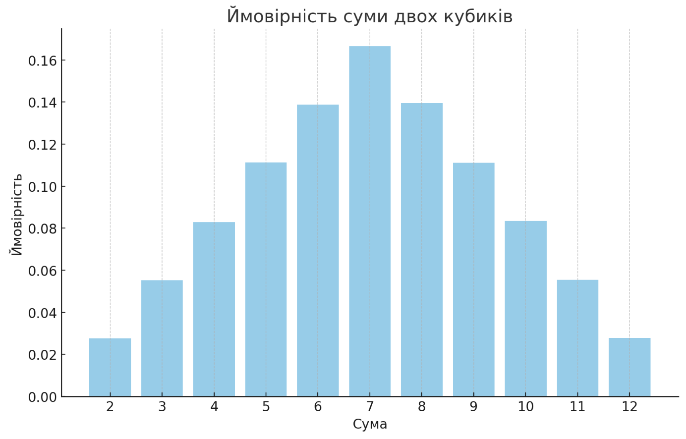

# Висновки до завдання 7

Програма успішно симулювала кидання двох кубиків 1,000,000 разів і обчислила ймовірності кожної можливої суми чисел. Ось результати:

| Сума | Ймовірність |
|------|-------------|
| 2    | 2.77%       |
| 3    | 5.53%       |
| 4    | 8.29%       |
| 5    | 11.13%      |
| 6    | 13.87%      |
| 7    | 16.65%      |
| 8    | 13.95%      |
| 9    | 11.11%      |
| 10   | 8.35%       |
| 11   | 5.56%       |
| 12   | 2.78%       |

Як видно з отриманих результатів, вони дуже близькі до аналітичних розрахунків, наведених у вашому запиті. Це підтверджує точність методу Монте-Карло для визначення ймовірностей у подібних задачах.

На графіку вище зображено ймовірності кожної суми. Він чітко показує, що найбільш ймовірна сума при киданні двох кубиків - це 7, а найменш ймовірні - 2 та 12, що повністю відповідає теоретичним розрахункам.
